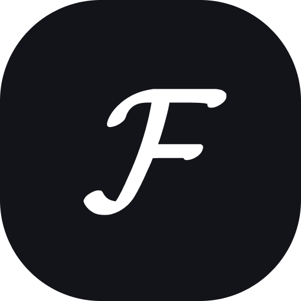
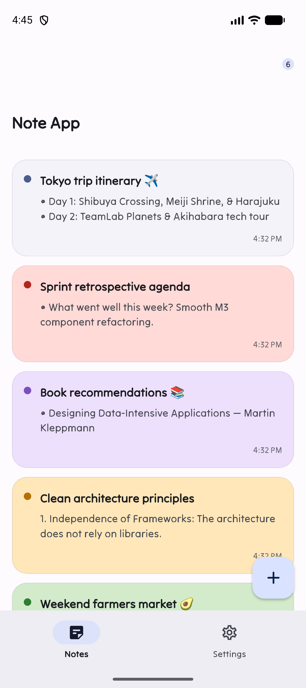
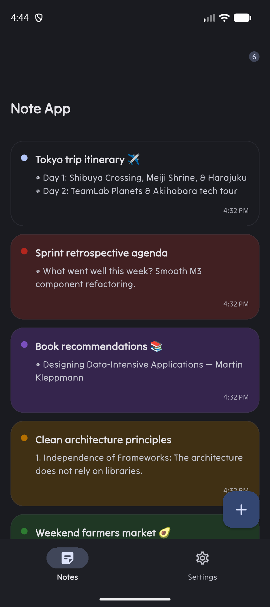
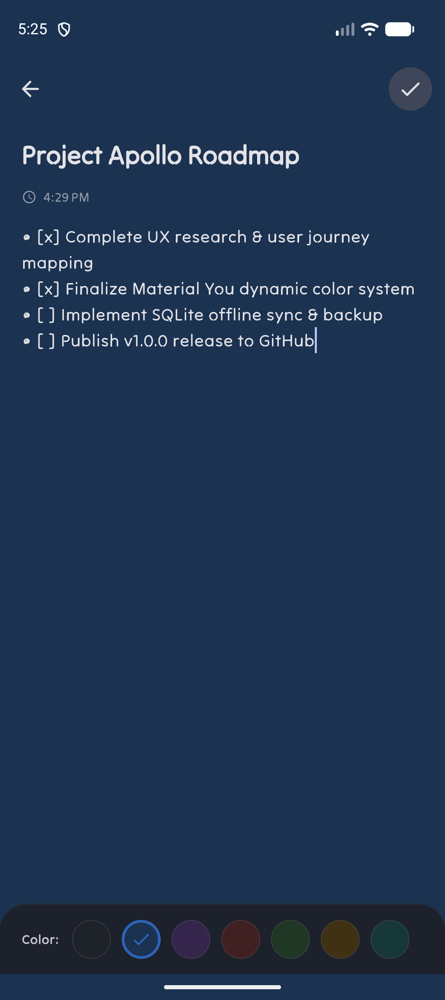
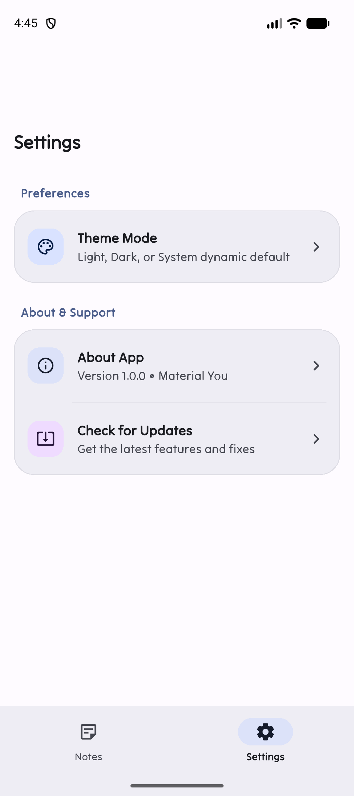
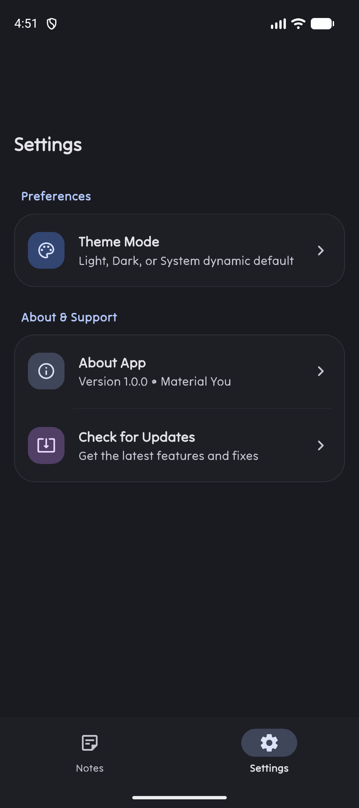

# 📝 Note App — Pure Material You (Material 3)

<p align="center">
  
</p>

<p align="center">
  <strong>A modern, offline-first note-taking app crafted with Flutter and pure Material You (M3) design principles.</strong>
</p>

<p align="center">
  
  
  
  
</p>

---

## 📸 Screenshots

<p align="center">
  
  
  
  
  
</p>

---

## ✨ Features

- 🎨 **Monet Dynamic Color (Android 12+)**: Dynamically harmonizes with the user's wallpaper color palette via `dynamic_color`.
- 📐 **Pure Material 3 Aesthetic**: Native android apps inspired UI with collapsible `SliverAppBar.large`, tonal cards (`surfaceContainer`), rounded dialogs (28dp), and zero hardcoded colors.
- 📱 **Adaptive Navigation**: Seamless transition between mobile `NavigationBar` (pill indicator) and wide-screen/tablet `NavigationRail`.
- 🏷️ **Harmonized Note Color Palettes**: Tag and organize notes using soft, harmonized M3 color schemes.
- 🗄️ **Offline SQLite Database**: Fast, reliable local persistence using `sqflite` with singleton connection pooling.
- ⚡ **Batch Selection & Deletion**: Quick multi-select mode to manage or bulk delete notes.
- 🌓 **Theme Modes**: Seamless switching between Light, Dark, and System dynamic modes.

---

## 🛠️ Tech Stack & Architecture

- **Framework**: [Flutter](https://flutter.dev) (Dart 3.5+)
- **State Management**: [Provider](https://pub.dev/packages/provider)
- **Local Persistence**: [sqflite](https://pub.dev/packages/sqflite) & [path](https://pub.dev/packages/path)
- **Dynamic Theming**: [dynamic_color](https://pub.dev/packages/dynamic_color) & [shared_preferences](https://pub.dev/packages/shared_preferences)
- **Design System**: Material 3 (Material You) with `TiltNeon` typography

---

## 📁 Project Structure

```text
lib/
├── Data/
│   └── note_data.dart            # Note data model with serialization & copyWith
├── Dialogs/
│   ├── about_dialog.dart         # M3 About app dialog (28dp rounded)
│   ├── theme_dialog.dart         # Dynamic theme selector dialog
│   └── update_dialog.dart        # In-app version & update checker dialog
├── Funcs/
│   └── func.dart                 # Color palettes, date formatters & utility helpers
├── SQL/
│   └── local_database.dart       # Singleton SQLite database manager
├── Screens/
│   ├── home_page.dart            # Adaptive layout (NavigationBar / NavigationRail)
│   ├── list_note_page.dart       # Collapsible SliverAppBar notes overview
│   ├── create_note_page.dart     # New note editor with tonal color picker
│   ├── note_page.dart            # Note detail & edit screen
│   └── settings_page.dart        # Grouped M3 preferences & about settings
├── Themes/
│   ├── light_theme.dart          # M3 light theme builder with dynamic color support
│   ├── dark_theme.dart           # M3 dark theme builder with dynamic color support
│   └── theme_provider.dart       # Theme mode state management & persistence
├── Widgets/
│   ├── note_card.dart            # Reusable M3 note card component
│   ├── note_color_picker.dart    # Horizontal tonal color selector
│   ├── loading_widget.dart       # M3 loading state component
│   └── error_widget.dart         # M3 error state component
└── main.dart                     # App entry point with DynamicColorBuilder
```

---

## 🚀 Getting Started

### Prerequisites

- Flutter SDK `^3.5.3` or higher
- Android Studio / VS Code with Flutter extension
- Android device or emulator running Android 12+ (for Monet dynamic theming)

### Installation

1. **Clone the repository:**
   ```bash
   git clone https://github.com/your-username/note_app.git
   cd note_app
   ```

2. **Install dependencies:**
   ```bash
   flutter pub get
   ```

3. **Run the app:**
   ```bash
   flutter run
   ```

4. **Run tests:**
   ```bash
   flutter test
   ```

---

## 📄 License

This project is licensed under the MIT License — see the [LICENSE](LICENSE) file for details.

